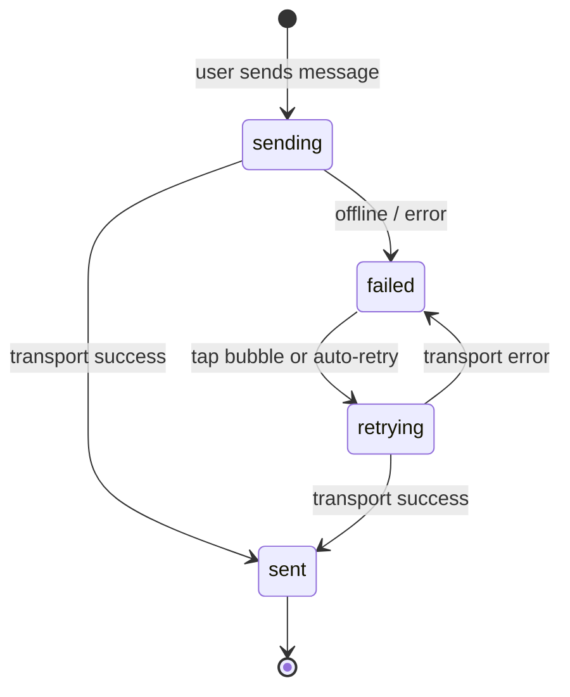

# Message lifecycle

Outbound messages (author = **me**) follow an explicit delivery state machine. Inbound messages always display as **sent** — delivery tracking applies only to the local user's sends.

## States

| State | Meaning | UI |
|-------|---------|-----|
| `sending` | Optimistic local write; transport in flight | Spinner on bubble |
| `sent` | Transport acknowledged success | Checkmark (or no indicator) |
| `failed` | Offline or transport error | Warning icon; tappable to retry |
| `retrying` | Manual or automatic retry in flight | Spinner on bubble |

## State diagram

## Allowed transitions

Enforced by `MessageDeliveryState.canTransition(to:)` and checked in `ChatRepository.transition`:

| From | To | Trigger |
|------|-----|---------|
| `sending` | `sent` | `MockChatTransport.send` succeeds |
| `sending` | `failed` | offline, simulated failure, or thrown error |
| `failed` | `retrying` | user tap, context menu, or `flushFailedMessages` |
| `retrying` | `sent` | transport success |
| `retrying` | `failed` | transport error |
| `sent` | `sent` | idempotent no-op |

Invalid transitions (e.g. `sending` → `retrying`, `sent` → `failed`) are ignored at the repository layer.

## Sequence: optimistic send

1. User taps **Send** in `ChatViewController`.
2. `ChatViewModel` calls `ChatRepository.sendText`.
3. Repository creates `ChatMessage` with `deliveryState: .sending`.
4. `MessageMapper.toRecord` persists to `LocalChatStore` immediately (optimistic).
5. `messagesDidChange` fires → UI shows bubble with spinner.
6. `dispatchSend` runs async on `MockChatTransport`.
7. On success: `transition(..., to: .sent)`.
8. On failure: `transition(..., to: .failed)`.

## Persistence

Delivery state is stored in `chat_store.json` alongside message content. Relaunching the app preserves failed messages so the user can retry later.

## Code references

- State enum: `Core/Models/MessageDeliveryState.swift`
- Transition logic: `Core/Repositories/ChatRepository.swift` (`transition`, `dispatchSend`)
- UI mapping rules: `Core/Mapping/MessageMapper.swift` (inbound always `.sent`)
- Tests: `RealtimeOfflineChatTests/MessageDeliveryStateTests.swift`, `ChatRepositoryTests.swift`
