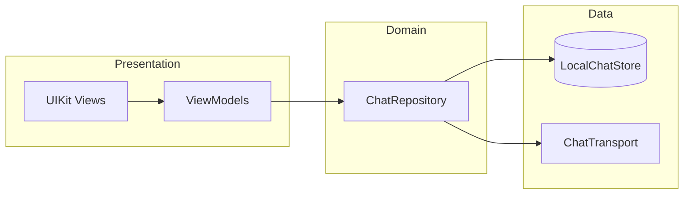
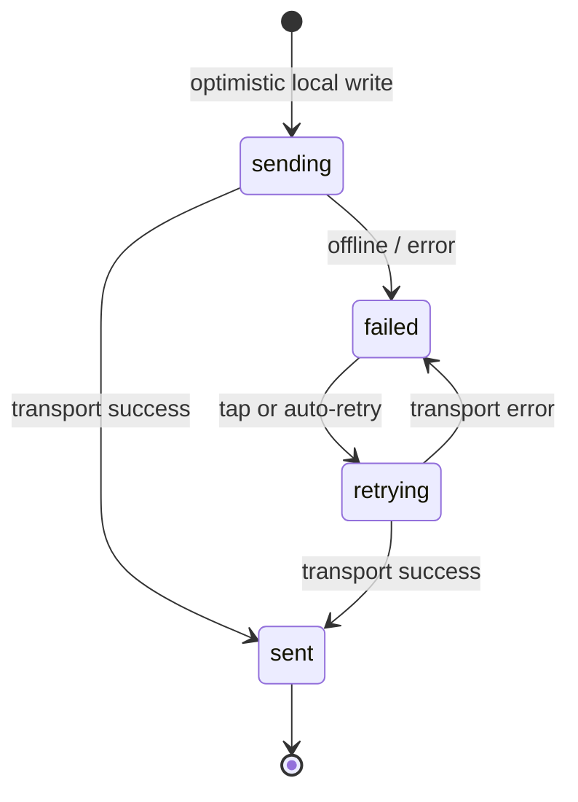
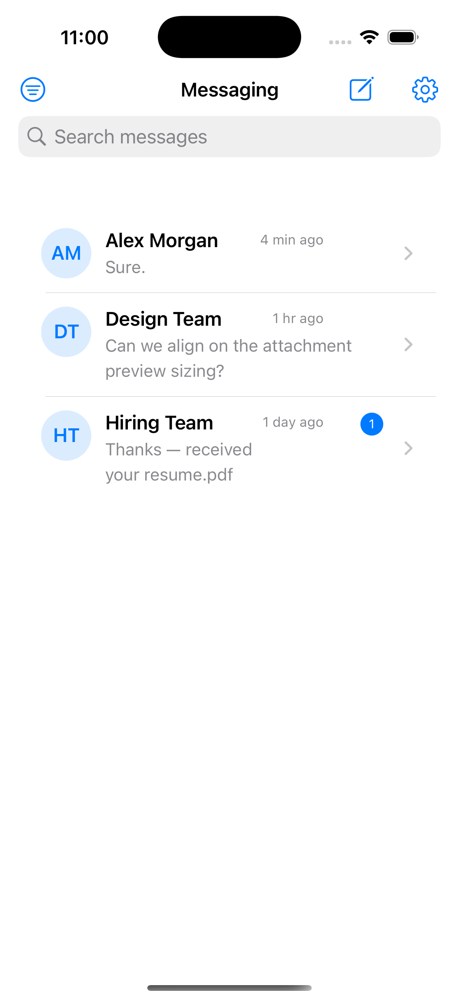
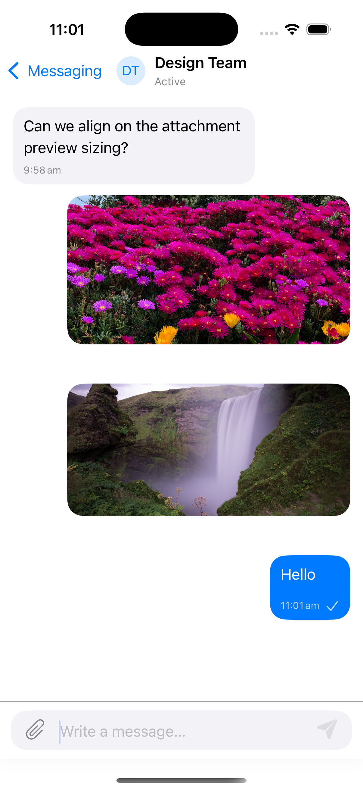
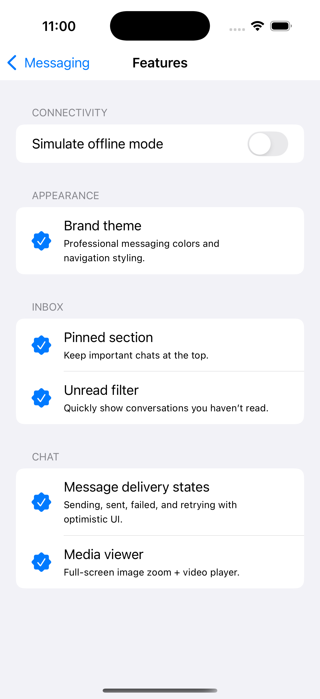
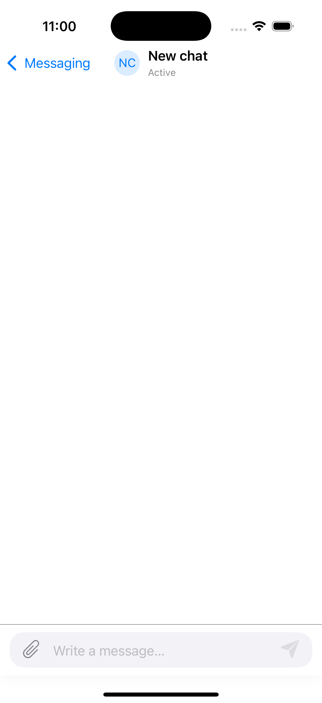

# iOS Real-Time Offline Chat

[](https://github.com/sameh-bakleh/ios-realtime-offline-chat/actions/workflows/ios-ci.yml)


> **GitHub description:** Real-time iOS chat client with message states, local persistence, offline-aware UX, attachment handling, testable architecture, and CI.

**UIKit messaging client with delivery states, offline queueing, and testable MVVM architecture.**

Native iOS sample for **Senior iOS Engineer** and **Mobile Engineer** roles — focused on message lifecycle, optimistic UI, local persistence, and a swappable transport layer. Clone-and-run with **no API keys** (`MockChatTransport` simulates latency, failures, and offline mode).

| | |
|---|---|
| **Repo** | [`ios-realtime-offline-chat`](https://github.com/sameh-bakleh/ios-realtime-offline-chat) |
| **Scheme** | `RealtimeOfflineChat` |
| **Platform** | iOS 16+ · Swift 5.9+ |
| **Stack** | Swift · UIKit · MVVM · Combine · XCTest · GitHub Actions |
| **Evaluate in** | ~10 min (clone → test → skim `Core/` + `Features/`) |

**Topics:** `swift` · `ios` · `uikit` · `chat-app` · `realtime` · `offline-first` · `mvvm` · `local-persistence` · `mobile-engineering` · `portfolio`

---

## At a glance

| Question | Answer |
|----------|--------|
| **What is it?** | A production-style chat client: inbox, threads, attachments, delivery states, offline retry. |
| **Why does it matter?** | Messaging is where mobile engineering shows up — optimistic UI, state machines, offline behaviour, retry logic. |
| **What skills does it prove?** | UIKit · MVVM · Combine · message state machine · local persistence · attachment pipeline · XCTest · CI |
| **Why should a recruiter care?** | Runnable without credentials, documented lifecycle, 14 unit tests, CI on every push. |

---

## Recruiter summary

This project demonstrates **how I build a maintainable iOS messaging client**:

- **Outbound message lifecycle** — `sending` → `sent` / `failed` → `retrying`, enforced in code and unit tests
- **Offline-aware UX** — messages persist locally first; failed sends expose retry affordances; auto-retry on reconnect with exponential backoff
- **Clean architecture** — View → ViewModel → Repository → (`LocalChatStore` + `ChatTransport`)
- **Production-minded details** — programmatic UI, attachment pipeline, image downsampling, keyboard handling, XCTest coverage, CI

**What it is not:** a Firebase/WebSocket production client. Network I/O is intentionally mocked so reviewers can run and test everything without credentials. The `ChatTransport` protocol is the extension point for a real backend.

---

## Features

| Area | Ships in this repo |
|------|-------------------|
| **Inbox** | Search, pinned/recent sections, unread & pinned filters, swipe pin/delete |
| **Chat** | Left/right bubbles, timestamps, growing composer, copy/share/delete |
| **Attachments** | Photos & videos (`PHPicker`), files (`UIDocumentPicker`), QuickLook, full-screen viewer |
| **Delivery states** | `sending`, `sent`, `failed`, `retrying` — inline status on outbound bubbles |
| **Offline demo** | Settings toggle simulates offline; messages queue locally as `failed` |
| **Retry** | Tap failed bubble, context menu, or auto-retry when back online |
| **Persistence** | `Documents/chat_store.json` + `Documents/Attachments/` |

---

## Tech stack

| Category | Technologies |
|----------|--------------|
| Language | Swift 5.9 |
| UI | UIKit (100% programmatic) |
| Architecture | MVVM, repository pattern, composition root (`AppEnvironment`) |
| Reactive | Combine (`@Published`, publishers) |
| Networking | `ChatTransport` protocol + `MockChatTransport` (no third-party SDK) |
| Persistence | `Codable` JSON, FileManager |
| Media | ImageIO downsampling, AVKit, PhotosUI |
| Testing | XCTest |
| CI | GitHub Actions on `macos-14` |
| Project gen | XcodeGen |

---

## Architecture overview



**Flow:** User action → ViewModel → Repository writes optimistically to disk → async transport send → state update → ViewModel publishes → UI refreshes.

Deep dives:

- [Architecture](Docs/ARCHITECTURE.md)
- [Message lifecycle](Docs/MESSAGE_LIFECYCLE.md)
- [Offline & retry strategy](Docs/OFFLINE_RETRY.md)



**Retry policy:** `RetryPolicy` applies exponential backoff (cap 30s) on automatic retries; up to 5 attempts. Manual retry from the UI bypasses the delay.

---

## Folder structure

```
App/                        AppDelegate, SceneDelegate, AppEnvironment
Core/
  Configuration/            MockChatConfiguration
  Models/                   ChatModels, ConversationModels, MessageDeliveryState
  Networking/               ChatTransport, MockChatTransport, ConnectivityMonitor
  Repositories/             ChatRepository
  Mapping/                  MessageMapper
  Services/                 RetryPolicy
  Persistence/              LocalChatStore, AttachmentStorage
  Theme/                    AppTheme
Features/
  Inbox/                    ConversationsListViewController, InboxViewModel
  Chat/                     ChatViewController, ChatViewModel, cells, media
  Settings/                 FeaturesViewController (offline toggle)
Resources/                  Assets.xcassets
RealtimeOfflineChatTests/
Docs/
  ARCHITECTURE.md
  MESSAGE_LIFECYCLE.md
  OFFLINE_RETRY.md
  Screenshots/
.github/workflows/          ios-ci.yml
project.yml
```

---

## Screenshots

| Inbox | Chat thread | Features / offline demo | New chat |
|-------|-------------|-------------------------|----------|
|  |  |  |  |
| Search, pinned conversations, unread badge | Text + attachments, sent state | Offline toggle and shipped capabilities | Empty thread with composer |

---

## How to run

**Requirements:** macOS, Xcode 15+, iOS 16+ simulator, [XcodeGen](https://github.com/yonaskolb/XcodeGen).

```bash
git clone https://github.com/sameh-bakleh/ios-realtime-offline-chat.git
cd ios-realtime-offline-chat
brew install xcodegen
xcodegen generate
open RealtimeOfflineChat.xcodeproj
```

Run scheme **RealtimeOfflineChat** on a simulator.

**Quick demo**

1. Send a message → observe `sending` → `sent`.
2. Tap **gear** → **Simulate offline mode** → send → `failed`.
3. Disable offline → auto-retry, or tap the failed bubble to retry manually.

---

## How to test

```bash
xcodegen generate
xcodebuild test \
  -project RealtimeOfflineChat.xcodeproj \
  -scheme RealtimeOfflineChat \
  -destination 'platform=iOS Simulator,name=iPhone 16,OS=latest' \
  CODE_SIGNING_ALLOWED=NO
```

| Test file | What it verifies |
|-----------|------------------|
| `MessageDeliveryStateTests` | Allowed and rejected state transitions |
| `RetryPolicyTests` | Backoff calculation and cap |
| `MessageMapperTests` | Inbound vs outbound delivery display rules |
| `ChatRepositoryTests` | Send, offline failure, manual/auto retry, delete persistence |

---

## CI/CD

Workflow: [`.github/workflows/ios-ci.yml`](.github/workflows/ios-ci.yml)

| Step | Action |
|------|--------|
| Trigger | Push / PR to `main` or `master`; manual `workflow_dispatch` |
| Runner | `macos-15` |
| Setup | `brew install xcodegen` → `xcodegen generate` |
| Simulator | Auto-resolves latest available iOS runtime (iPhone 16) |
| Build | `xcodebuild build` with `CODE_SIGNING_ALLOWED=NO` |
| Test | `xcodebuild test` — unit tests for state machine and repository |
| Artifact | `xcresult` bundle on failure (7-day retention) |

---

## Security & privacy

- **No secrets** — no Firebase, API keys, or private endpoints in source control.
- **Sandbox only** — messages and attachments stay under the app `Documents` directory.
- **Mock transport** — all outbound traffic is simulated locally.

Details: [SECURITY.md](SECURITY.md) · [CONTRIBUTING.md](CONTRIBUTING.md)

---

## Contact

| | |
|---|---|
| **Email** | [samhbkeng1992@gmail.com](mailto:samhbkeng1992@gmail.com) |
| **LinkedIn** | [linkedin.com/in/sameh-bakleh](https://www.linkedin.com/in/sameh-bakleh/) |
| **GitHub** | [github.com/sameh-bakleh](https://github.com/sameh-bakleh) |
| **Related** | [iOS Marketplace App](https://github.com/sameh-bakleh/ios-marketplace-product-app) · [Laravel Marketplace API](https://github.com/sameh-bakleh/laravel-marketplace-platform) |

---

## License

MIT — see [LICENSE](LICENSE).
